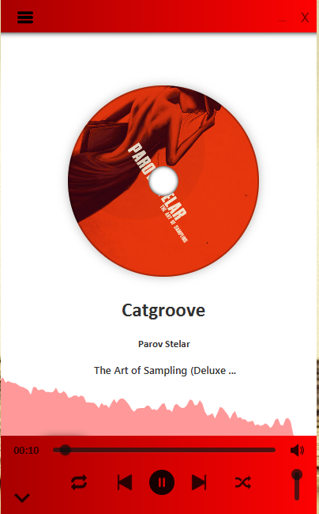
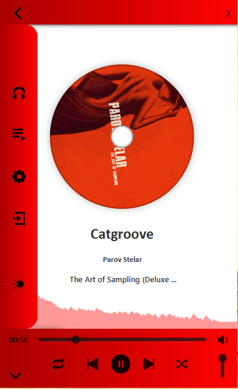
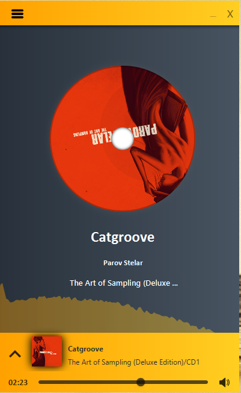
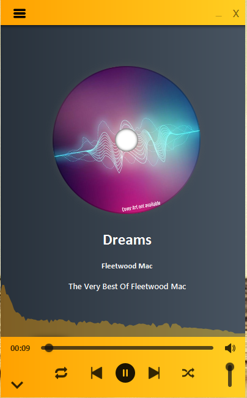
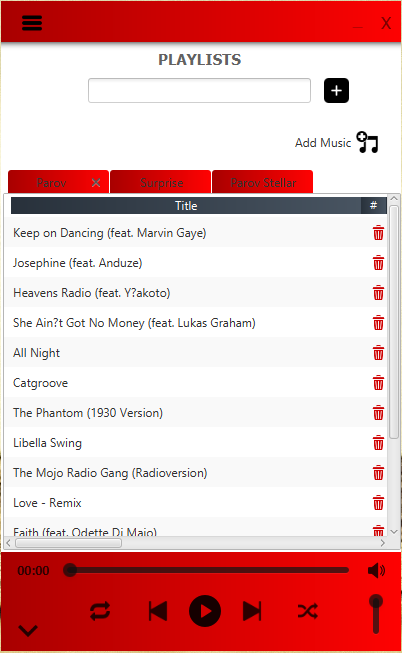
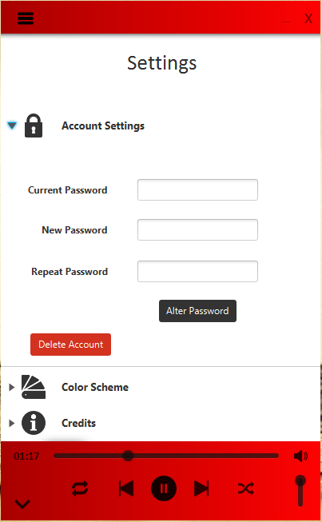
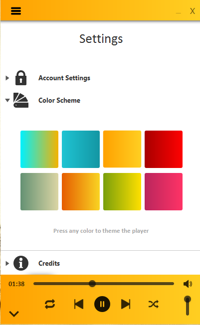

# MediaPlayer-AudioSpectrum

Mediaplayer app in javaFX with audio spectrum visualizer and DB connection
Uses the Tika Apache .jar to retrieve metadata information from musics to generate details

## Front

## SideMenu

## DarkMode

## Cover Not Available

## Playlist

## Settings

## Colors

